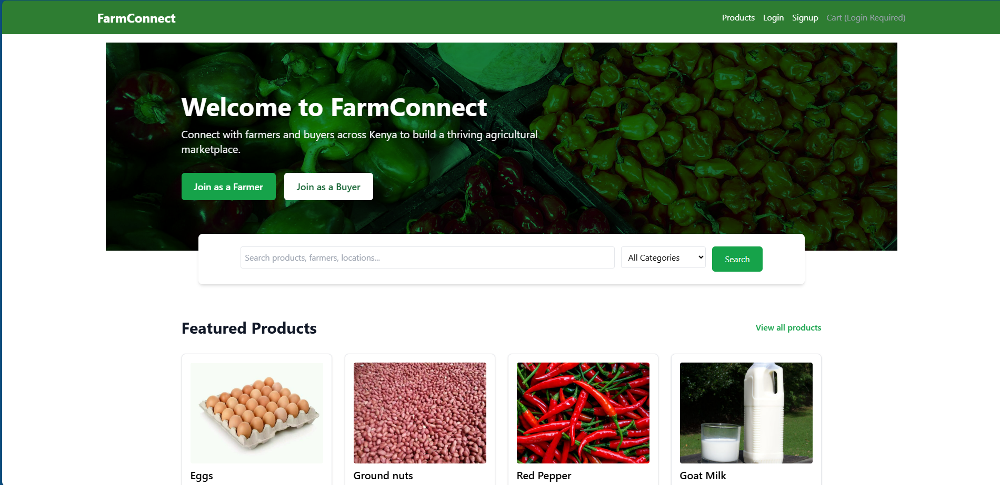
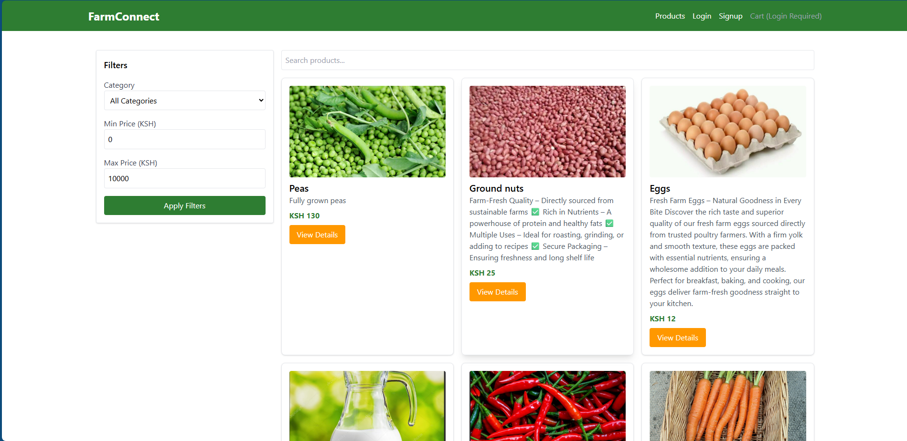
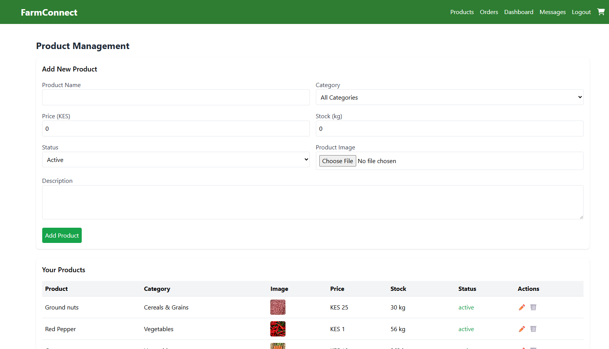
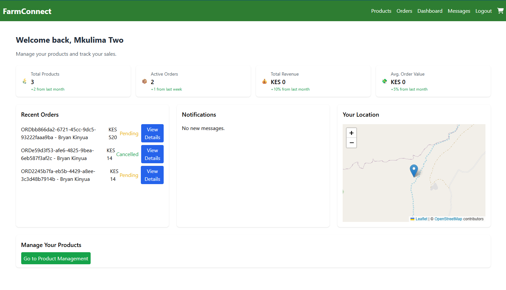
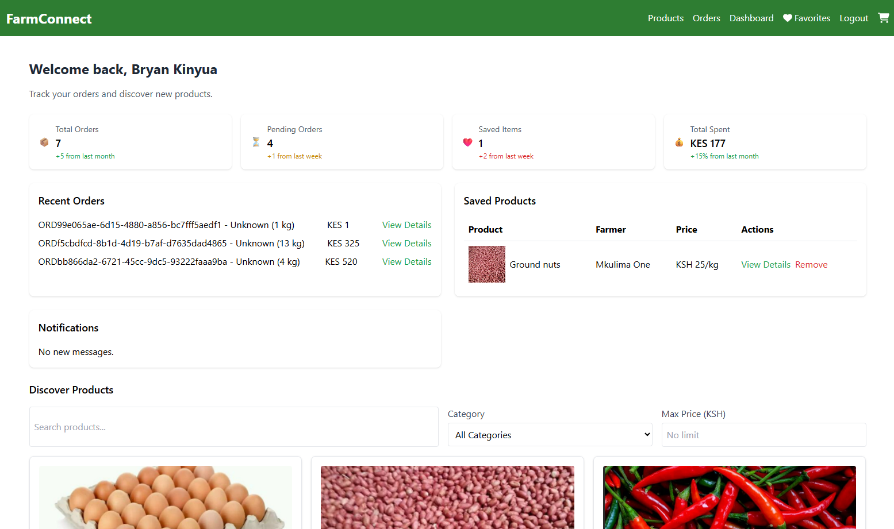
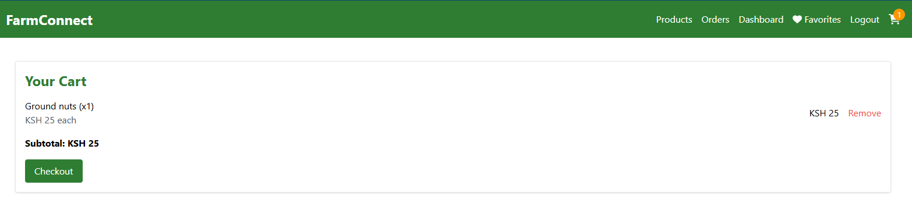

# Hi there, I'm Brian Kinyua 👋

## About Me 🚀

I'm a passionate cybersecurity enthusiast. I love tackling complex problems, learning new skills, and collaborating with diverse teams to create innovative solutions.

- 🌱 Currently learning: Ethical and Web Application Security
- 🔭 Working on: Penetration testing
- 🌍 Languages: HTML, CSS, JS, Python, Java
- 📫 How to reach me: bryankiragu123@gmail.com
- ⚡ Fun fact: Glitch Hunter

## My Skills 🧠

## Featured Projects 💻

## farmconnect
Connecting Kenyan farmers directly with buyers for fairer prices and sustainable agriculture.

### Homepage Screenshot

### Marketplace Screenshot

### Productmanagement Screenshot

### Farmerdashboard Screenshot

### Buyerdashboard Screenshot

### Cart Screenshot

## Get in Touch 📬

- **[LinkedIn]**([your_linkedin_profile_link](https://www.linkedin.com/in/brian-kinyua-4bkk2284k2/))

